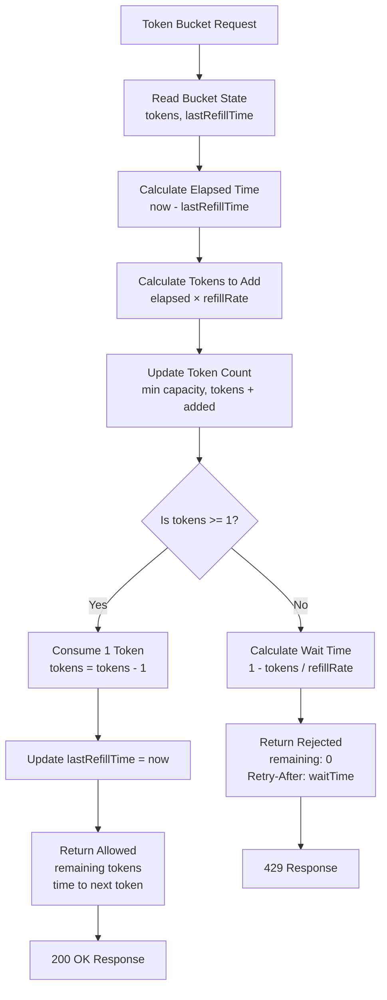
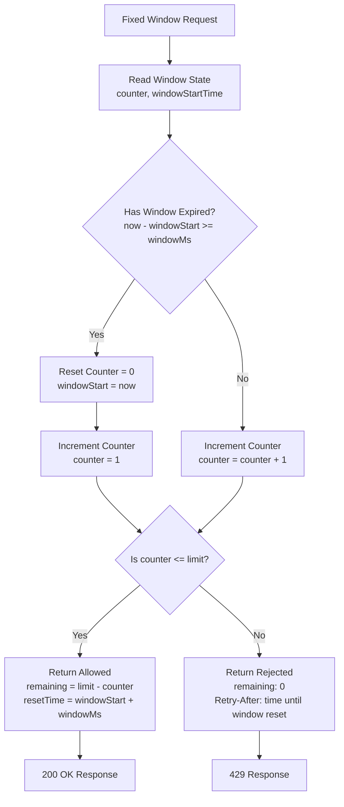
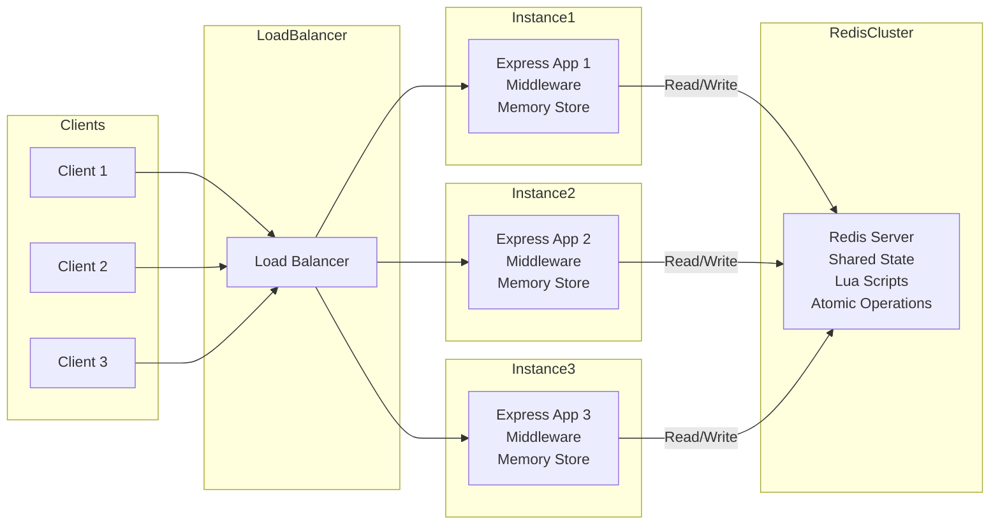
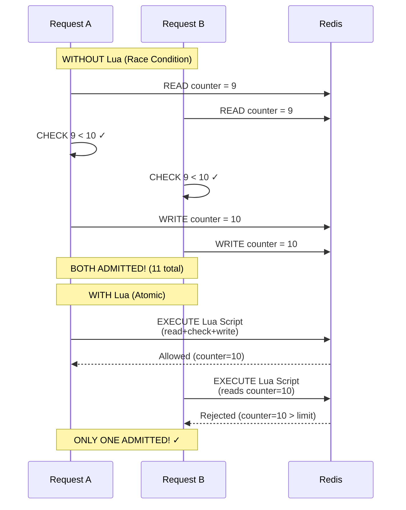
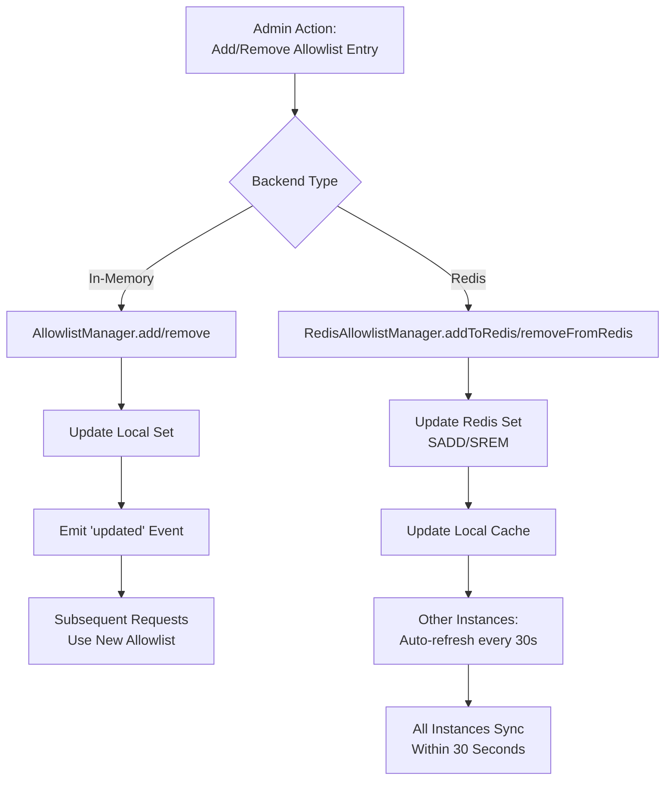
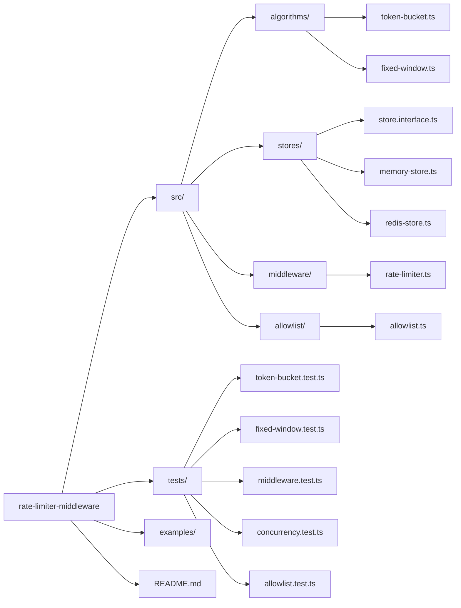
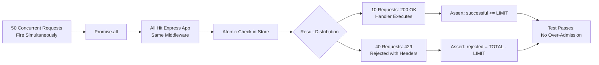

# Rate Limiter Control Flow Diagrams

## 1. Token Bucket Algorithm

## 2. Fixed Window Algorithm

## 3. Distributed Architecture

## 4. Race Condition Problem & Solution

## 5. Allowlist Runtime Update Flow

## 6. Project Structure

## 7. Concurrency Test Flow

